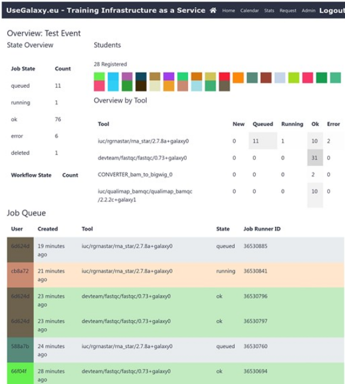

<!-- .slide: data-background="images/index.jpg" data-state="dim-background" -->
## My Training Journey

 

Bérénice Batut

<small>IFB / AuBi   She/her - <i class="fab fa-github"></i> @bebatut - <i class="fas fa-envelope"></i> berenice.batut@uca.fr</small>

 

<small>IFB GT Formation - January 2024</small>

---
### 2015 - mid 2016

- Postdoc in Clermont-Ferrand
- Became Software Carpentry Instructor Training

---
### Mid 2016

- Moved to Freiburg, Germany
- Started the Galaxy Training Network as it is now

----
### Galaxy and Training

Training for the community, by the community

----
### Galaxy Training Network

<!-- .element width="50%" style="box-shadow: 5px 5px 5px grey !important;" -->

[https://training.galaxyproject.org/](https://training.galaxyproject.org/)

----
### A collection of FAIR training material

----
### Training Infrastructure as a Service

---
### Mid 2016 - 2018

- Moved to Freiburg, Germany
- Started the Galaxy Training Network as it is now
- Involved with the Carpentries
- Followed the Mozilla Open Leaders
- Started the [Street Science Community](https://streetscience.community/) with the BeerDEcoded project

----
### BeerDEcoded

<!-- .element width="60%" style="box-shadow: 5px 5px 5px grey !important;" -->

[https://streetscience.community/projects/beerdecoded/](https://streetscience.community/projects/beerdecoded/)

----
### [WIP] DNAnalyzer

<!-- .element width="80%" style="box-shadow: 5px 5px 5px grey !important;"-->

[https://dnanalyzer.apps.galaxyproject.eu/](https://dnanalyzer.apps.galaxyproject.eu/)

----
### [WIP] DNAnalyzer

<!-- .element style="box-shadow: 5px 5px 5px grey !important;"-->

[https://dnanalyzer.apps.galaxyproject.eu/](https://dnanalyzer.apps.galaxyproject.eu/)

---
### 2019

- Involved in ELIXIR Training
    - Co-deputy training coordinator for ELIXIR Germany
    - FAIR Training Focus Group
- Co-funded OLS and Open Seeds program

----
### Open Seeds by OLS

A mentoring & training program for Open Science ambassadors

<!-- .element width="50%" -->

[https://openlifesci.org/openseeds/](https://openlifesci.org/openseeds/)

----
### Open Seeds by OLS

---
### 2020

- In Parental leave
- Wrote and go Horizon 2020 ERASMUS+ funding for Gallantries

---
### 2021

- Joined the ELIXIR Train the Trainers
- Co-organized GTN Smorgsboard

----
### Massive, online, & worldwide training events

Partneship with Bioconductor and RO-crates

---
### 2022

- Started the Galaxy Mentor Network
- Joined the GOBLET Executive Board
- Co-organized the Banbury Training Conference

----
### The Bicycle Principles for Effective, Inclusive, and Career-spanning Short-format Training

<!-- .element width="40%" --> 

[https://www.bikeprinciples.org/](https://www.bikeprinciples.org/)