<!-- .slide: data-background="images/index.jpg" data-state="dim-background" -->
## Exploring the Microbiome with Galaxy: Tools, Workflows, and Applications

 

Bérénice Batut

<small>Institut Francais de Bioinformatique / Auvergne Bioinformatique, Université Clermont Auvergne   She/her - <i class="fab fa-github"></i> @bebatut - <i class="fas fa-envelope"></i> berenice.batut@uca.fr</small>

 

<small>Journée Thématique "Métagénomique, Microbiome et ADN environnemental" - Groupe de Travail "Statistique et Génomique" - Réseau Interdisciplinaire autour de la Statistique - October 2024</small>

---
<!-- .slide: data-background-color="#dfcd71" -->

## What is Galaxy?

<!-- .element width="60%" -->

----
### Galaxy?

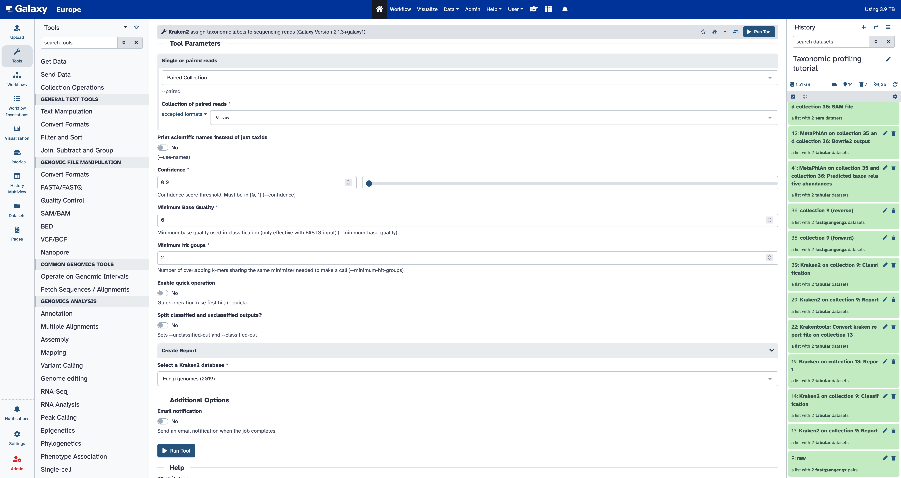<!-- .element width="80%" style="box-shadow: 5px 5px 5px grey !important;" -->

An **open-source** platform for **FAIR data analysis**

Note:
- Galaxy interface
- GUI for interactively running analysis tools on biomedical datasets
    - Tools
    - History
- Graphical interface for handling >1,000 samples
- Accessible via a Web browser

---
<!-- .slide: data-background-color="#dfcd71" -->

## What are the benefits of Galaxy?

<!-- .element width="60%" -->

----
### What are the benefits of Galaxy?

1. **Accessibility** — Empower scientists regardless of informatics expertise/access to infrastructure

Note:
- Accessibility
    - Data-intensive science requires use of large datasets, computational resources, and analysis methods
    - Human reference / annotation and example datasets are huge, but a Galaxy instance can host them as shared data for all users (no download/upload hassle, just ready to use in your analysis)

----
### Accessibility?

<!-- .element width="80%" style="box-shadow: 5px 5px 5px grey !important;" -->

A **graphical web interface** for **running tools interactively**

Note:
- Interface

----
### Accessibility?

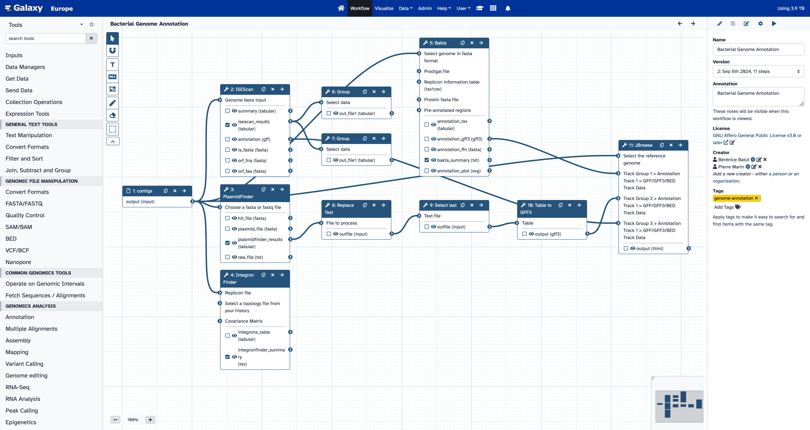<!-- .element width="80%" style="box-shadow: 5px 5px 5px grey !important;" -->

A graphical web interface to a **powerful workflow system**

Note:
- Workflows

----
### Accessibility?

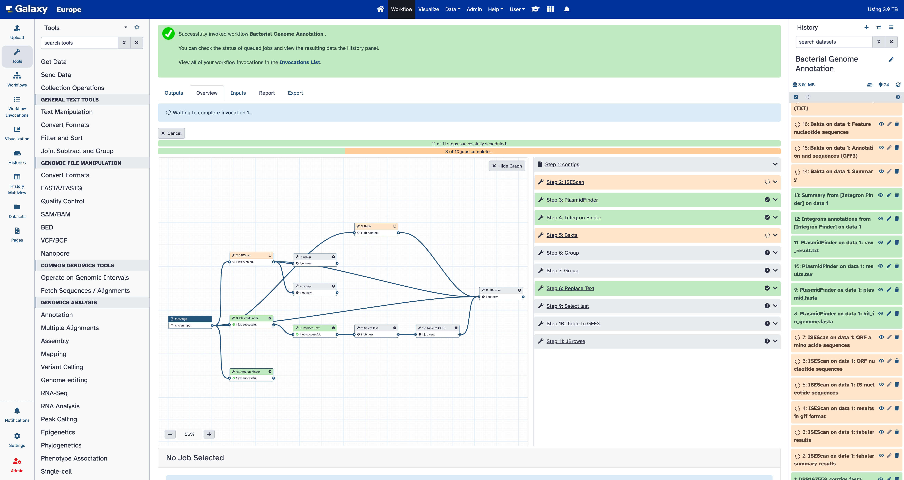<!-- .element width="80%" style="box-shadow: 5px 5px 5px grey !important;" -->

A graphical web interface to a **powerful workflow system**

Note:
- Workflows

----
### Accessibility?

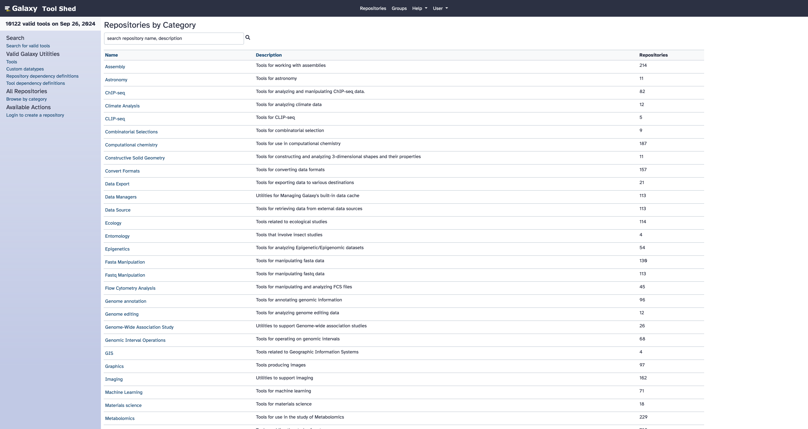<!-- .element width="80%" style="box-shadow: 5px 5px 5px grey !important;" -->

10k+ possible **command-line tools**

----
### Accessibility?

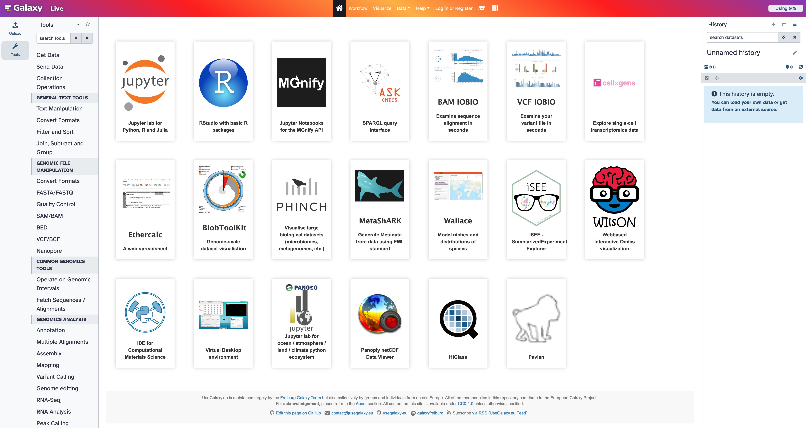<!-- .element width="80%" style="box-shadow: 5px 5px 5px grey !important;" -->

**Interactive web tools** in Galaxy

Note:
- Tree, with trunc QC - Mapping, branch analysis and leaves Jupyter and interactive tools
- Interactive tools: R / Python
Makes interactive web tools available in Galaxy

Some examples:
Jupyter and RStudio for programmatic analyses
CellxGene for dynamic visualization

----
### Accessibility?

Many ways to get data into Galaxy

- Using **Upload Data**
    - Import from your computer
    - Create file by directly entering text
    - Import from a **URL**
    - Import from S3, DropBox, GoogleDrive
- Using **external public sources** e.g. UCSC, SRA
- From the **shared Galaxy Data Library**

----
### Accessibility?

- **Combining** datasets into **collections** to minimize clutter

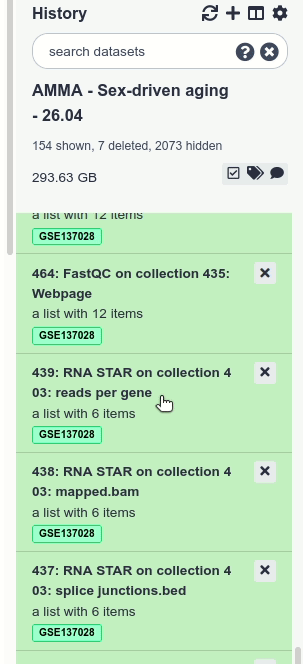<!-- .element width="20%" style="box-shadow: 5px 5px 5px grey !important;" -->

Note:
In Galaxy you perform data analyses and organize your data simply by clicking on things. If you have just a few items in your history, clicking is easy. However, in most real-world analyses you never have just a few datasets, instead you have many (sometimes thousands)
Not only may clicking on thousands datasets lead to a severe form of [carpal tunnel syndrome](https://en.wikipedia.org/wiki/Carpal_tunnel_syndrome), it may simply be impossible. **Collections** (also known as *Dataset collections* or *Lists*) described here help to resolve this situation and make very large analyses Galaxy-friendly.

A typical multi-dataset analysis of next-generation sequencing (NGS) data usually involves a large number of sequence datasets, such as, for example, fastq datasets generated by an Illumina machine or downloaded from a Short Read Archive. So it's usually a *collection* of similar things that need to be processed in a *collective* fashion.

A collection** is any number of datasets bundled as a **single** entity. In this example, to, say, map *N* fastq files against the human genome you need to manually start *N* mapping jobs. Yet if you first combine individual datasets into a collection, you will only need start a mapping job **once** using the collection as the only input.

----
### Accessibility?

- **Combining** datasets into **collections** to minimize clutter
- Reflecting **data complexity**

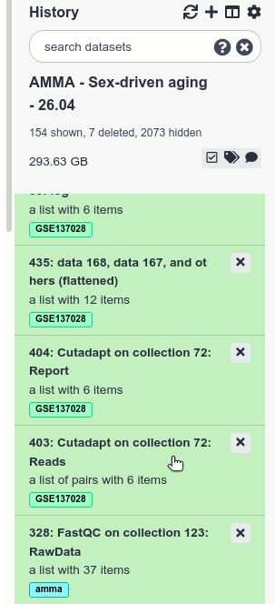<!-- .element width="20%" style="box-shadow: 5px 5px 5px grey !important;" -->

Note:
The previous image shows how multiple fastq datasets can be combined in a single collection. But what if the sequencing data one wants to analyze is from a paired-end (or mate-pair) run where each individual sample is represented by *two* fastq files: forward and reverse? Galaxy collections can accommodate this structure:

Paired collection** preserves the relationship between read pairs and their respective samples

----
### Accessibility?

- **Combining** datasets into **collections** to minimize clutter
- Reflecting **data complexity**
- Building collections using **rules**

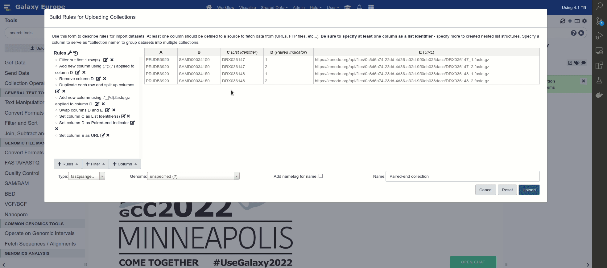<!-- .element width="70%" style="box-shadow: 5px 5px 5px grey !important;" -->

----
### Accessibility?

- **Combining** datasets into **collections** to minimize clutter
- Reflecting **data complexity**
- Building collections using **rules**
- Processing many samples at once

<!-- .element width="70%" style="box-shadow: 5px 5px 5px grey !important;" -->

----
### Accessibility?

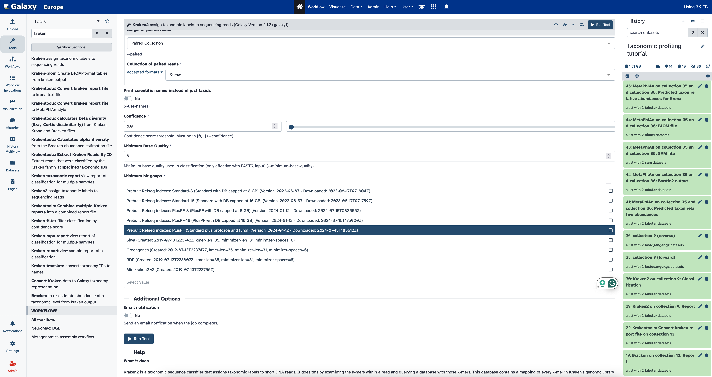<!-- .element style="box-shadow: 5px 5px 5px grey !important;" width="80%" -->

- \>5 TB+ of **reference data** [TO UDAPTE]
- \>200 **genomes** and annotations [TO UDAPTE]
- **Databases** for >140 tools [TO UDAPTE]

Note:
- Shared data
- Reference data: ~ 50 GB of annotation data selectable from a dropdown menu

----
### What are the benefits of Galaxy?

1. **Accessibility** — Empower scientists regardless of informatics expertise/access to infrastructure

2. **Reproducibility** — Ensure that data-intensive analyses are high-quality

Note:

- Accessibility
    - Data-intensive science requires use of large datasets, computational resources, and analysis methods
    - Human reference / annotation and example datasets are huge, but a Galaxy instance can host them as shared data for all users (no download/upload hassle, just ready to use in your analysis)
- Reproducibility
    - Critical for advancing science, including peer review, validation, and extension
    - Bioinformatics methods are a rapidly moving field, but without reproducibility you cannot compare different approaches

----
### Reproducibility?

<!-- .element style="box-shadow: 5px 5px 5px grey !important;" -->

Detailed **metadata** about each step in an analysis

Note:
- Open source: software framework, tools, and utilities
- Worflows
- Detailed metadata about each steps in analysis, stored in Galaxy’s database

----
### Reproducibility?

<!-- .element style="box-shadow: 5px 5px 5px grey !important;" -->

Workflows!

Note:
- Worflows

----
### What are the benefits of Galaxy?

1. **Accessibility** — Empower scientists regardless of informatics expertise/access to infrastructure

2. **Reproducibility** — Ensure that data-intensive analyses are high-quality

3. **Sharing** — Clearly communicating what has been done

Note:
- Sharing
    - Multiple levels of information are needed from broad overview down to essential details and actual data

----
### Sharing?

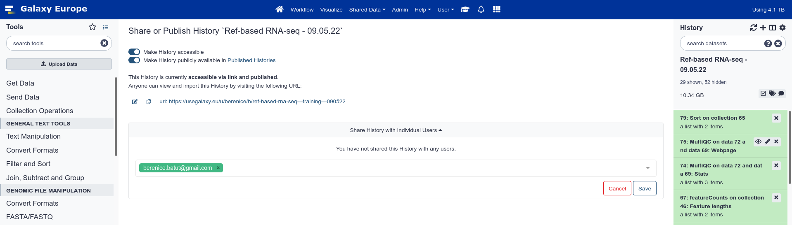<!-- .element style="box-shadow: 5px 5px 5px grey !important;" -->

**Any history**
- with **any user**
- via **link**
- published in the server's shared histories

----
### Sharing?

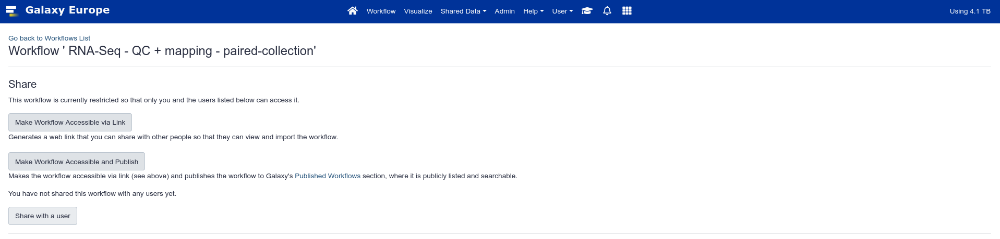<!-- .element style="box-shadow: 5px 5px 5px grey !important;" -->

**Any workflow**
- with **any user**
- via **link**
- published in the server's shared workflows

----
### What are the benefits of Galaxy?

1. **Accessibility** — Empower scientists regardless of informatics expertise/access to infrastructure

2. **Reproducibility** — Ensure that data-intensive analyses are high-quality

3. **Sharing** — Clearly communicating what has been done

4. **Computational resources and tailored usage**

----
### Many ways to use Galaxy

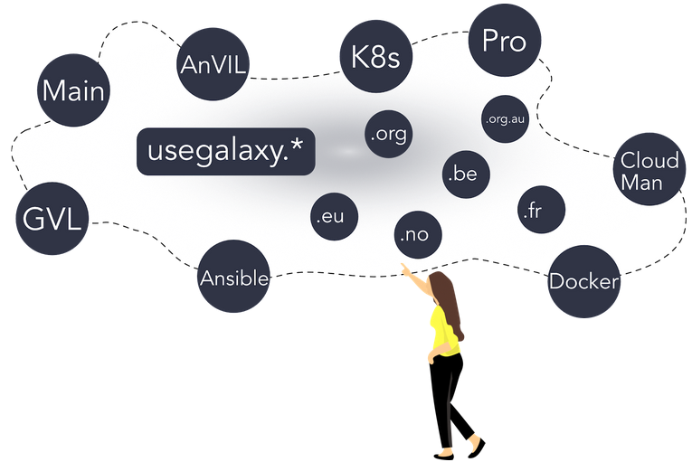<!-- .element width="80%" -->

Note:
1. Public servers such as UseGalaxy Servers instances, see https://galaxyproject.org/use/
2. Your laptop or local computer
3. Install locally with many compute environments
4. Deploy on a cloud

----
### UseGalaxy Servers

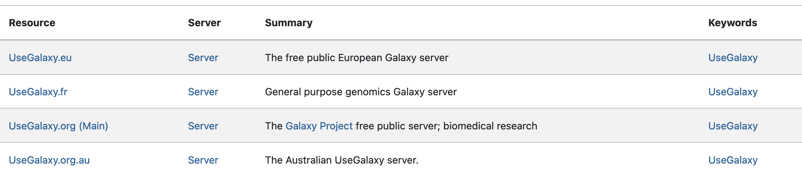<!-- .element width="80%" style="box-shadow: 5px 5px 5px grey !important;" -->

- **Free** registration
- **Thousands** of documented and maintained **tools**
- **250 GB** per user
- Computational resources

----
### What are the benefits of Galaxy?

1. **Accessibility** — Empower scientists regardless of informatics expertise/access to infrastructure

2. **Reproducibility** — Ensure that data-intensive analyses are high-quality

3. **Sharing** — Clearly communicating what has been done

4. **Computational resources and tailored usage**

5. **Extensive learning resources**

----
### How can you learn to use Galaxy?

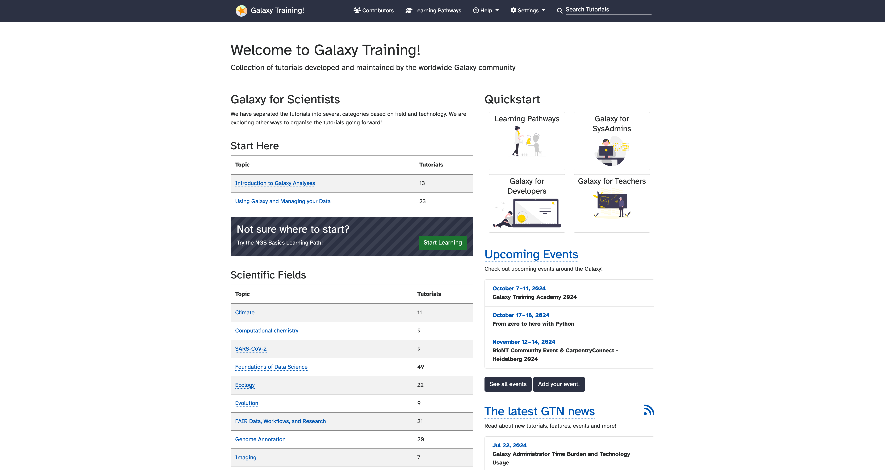<!-- .element width="90%" style="box-shadow: 5px 5px 5px grey !important;" -->

[training.galaxyproject.org](https://training.galaxyproject.org)

----
### How can you learn to use Galaxy?

<!-- .element width="45%" -->

----
### How can you learn to use Galaxy?

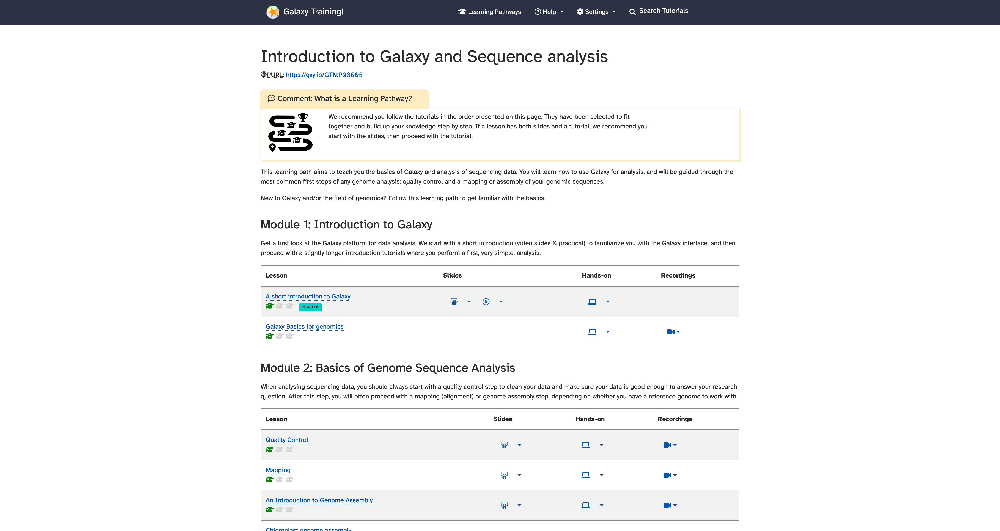<!-- .element width="45%" -->

----
### How can you learn to use Galaxy?

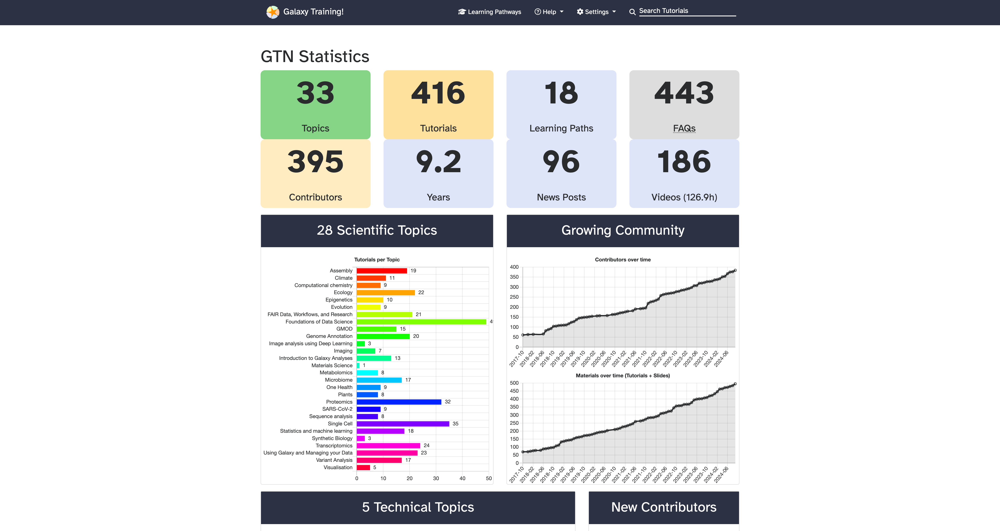<!-- .element width="90%" style="box-shadow: 5px 5px 5px grey !important;" -->

[training.galaxyproject.org](https://training.galaxyproject.org)

---
<!-- .slide: data-background-color="#dfcd71" -->
## How to use Galaxy for Microbiome data analysis?

<!-- .element width="60%" -->

Note:
Why Galaxy is a key tool for microbiome data analysis, particularly for its flexibility and interoperability.

----

### 200+ tools

----
### Peer-reviewd Workflows

----
### Metabarcoding

- **Tools**: QIIME2, DADA2, Mothur.
- **Applications**: Taxonomic classification of samples from environmental DNA.

----

### Metagenomics

- **Key Tools**: Metaphlan, Kraken, HUMAnN, Megahit, etc.
- **Applications**: Identification and quantification of microbial communities, functional analyses.

Pipeline for metagenomic analysis (from sequence quality to functional annotation).

----

### Metatranscriptomics

- **Tools**: HISAT2, StringTie, Kallisto.
- **Applications**: Study of gene expression in microbial communities, identification of active genes in specific environments.

Pipeline for metatranscriptomic analysis (read processing, assembly, annotation).

----

### Metaproteomics

- **Tools**: Prodigal, MaxQuant.
- **Applications**: Analysis of proteins expressed by microbial communities.

----

### Meta-omics

---

### Examples of Galaxy Applications for Microbiome Analysis**
   - **Environmental Microbiome Studies**:
     - Examples of microbiome analysis in specific ecosystems (soil, oceans, etc.).
   - **Biomedical Research**:
     - Studies on the gut microbiome and its impact on human health.
   - **Agriculture and Industry**:
     - Applications in the study of agricultural and industrial microbiomes.

----
**Microbiome-Specific Tutorials**
- Introduction to metagenomics with Galaxy.
- Analysis of metatranscriptomic data.
- Tutorials on metabarcoding with QIIME2.

----
Learning pathway

---
<!-- .slide: data-background-color="#dfcd71" -->

## How is ?????

<!-- .element width="60%" -->

----
### microGalaxy: a vibrant community

A community for anything microbiology in Galaxy to

- **Develop** and **Sustain** microbial data analysis in Galaxy by coordinating efforts
- Implement **standardised "best practices"**
- Expand **documentation** and **training**
- Write papers and **share** about our efforts
- Support each other
- Develop and Maintain a Subdomain/Lab on several Galaxy servers

----
### microGalaxy: a Subdomain/Lab on several Galaxy servers

----
### Join microGalaxy

- Join our [**quarterly meetings**](https://docs.google.com/document/d/13VjcUjStuIp7bK29e74k8Nqb7N4lmVcg1ioArEWr254/edit#)!
- Join our **working groups** (see above)
- Join the [Gitter **Chat**](https://gitter.im/galaxyproject/microGalaxy) (also available via[ Matrix](https://matrix.to/#/#galaxyproject_microGalaxy:gitter.im))
- Join the [**mailing list**](https://lists.galaxyproject.org/lists/microgalaxy.lists.galaxyproject.org/) microgalaxy@lists.galaxyproject.org
- Subscribe to the [**calendar**](https://calendar.google.com/calendar/embed?src=npu7puk75n6p0u4aapv5t21uj8%40group.calendar.google.com&ctz=Europe%2FBrussels)

---

### (micro)Galaxy: powerful resources and infrastructures for microbiome data analysis

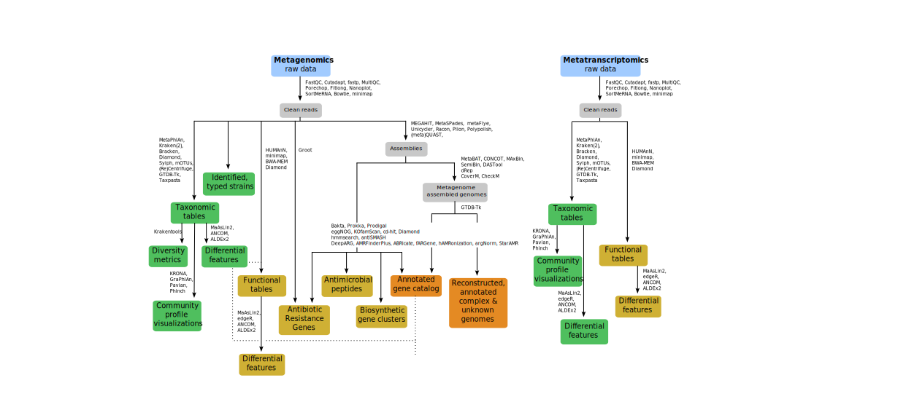<!-- .element width="80%" -->

Tools, Workflows, Computational Infrastructure, Training, People

---

## Thank You!

IFB logo, etc

---

### (micro)Galaxy: powerful resources and infrastructures for microbiome data analysis

---

