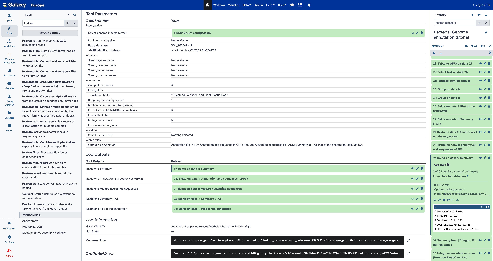
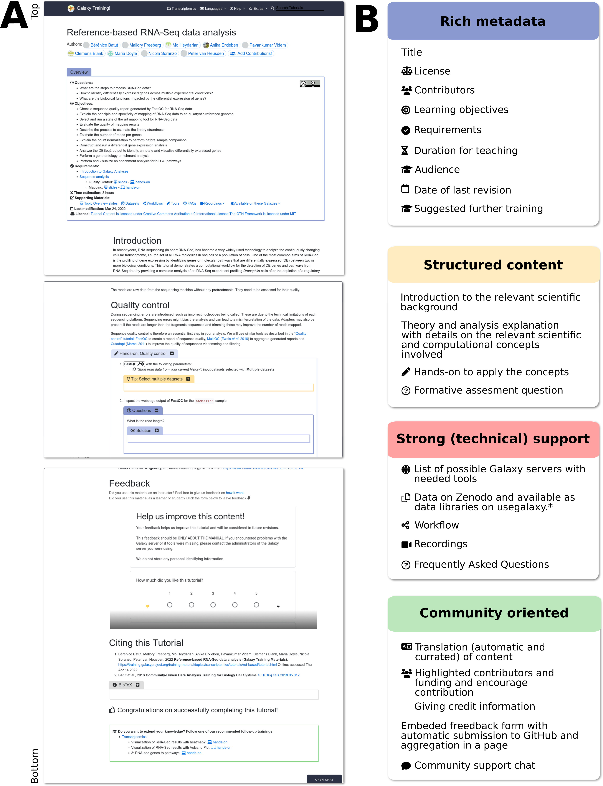
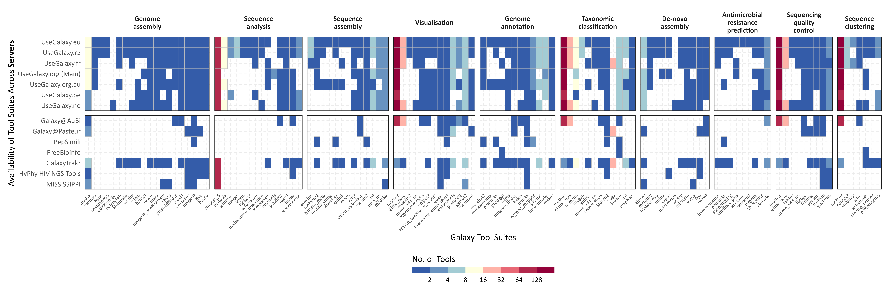
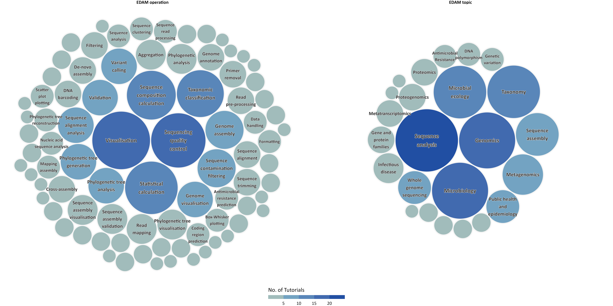

<!-- .slide: data-background="images/title.jpg" data-state="dim-background" -->
## Exploring the Microbiome with Galaxy: Tools, Workflows, and Applications

 

Bérénice Batut

<small>Institut Francais de Bioinformatique / Auvergne Bioinformatique, Université Clermont Auvergne   She/her - <i class="fab fa-github"></i> @bebatut - <i class="fas fa-envelope"></i> berenice.batut@uca.fr</small>

 

<small>Journée Thématique "Métagénomique, Microbiome et ADN environnemental" - Groupe de Travail "Statistique et Génomique" - Réseau Interdisciplinaire autour de la Statistique - October 2024</small>

<small style="position: absolute; right: 0%; font-size: 0.2em; ">Photo by [Elena Mozhvilo](https://unsplash.com/@miracleday?utm_source=unsplash&utm_medium=referral&utm_content=creditCopyText) on [Unsplash](https://unsplash.com/?utm_source=unsplash&utm_medium=referral&utm_content=creditCopyText) </small>

---
<!-- .slide: data-background-color="#dfcd71" -->

## What is Galaxy?

<!-- .element width="60%" -->

----
### Galaxy?

<!-- .element width="80%" style="box-shadow: 5px 5px 5px grey !important;" -->

An **open-source** platform for **FAIR data analysis**

Note:
- Galaxy interface
- GUI for interactively running analysis tools on biomedical datasets
    - Tools
    - History
- Graphical interface for handling >1,000 samples
- Accessible via a Web browser

---
<!-- .slide: data-background-color="#dfcd71" -->

## What are the benefits of Galaxy?

<!-- .element width="60%" -->

----
### What are the benefits of Galaxy?

1. **Accessibility** — Empower scientists regardless of informatics expertise/access to infrastructure

Note:
- Accessibility
    - Data-intensive science requires use of large datasets, computational resources, and analysis methods
    - Human reference / annotation and example datasets are huge, but a Galaxy instance can host them as shared data for all users (no download/upload hassle, just ready to use in your analysis)

----
### Accessibility?

<!-- .element width="80%" style="box-shadow: 5px 5px 5px grey !important;" -->

A **graphical web interface** for **running tools interactively**

Note:
- Interface

----
### Accessibility?

<!-- .element width="80%" style="box-shadow: 5px 5px 5px grey !important;" -->

A graphical web interface to a **powerful workflow system**

Note:
- Workflows

----
### Accessibility?

<!-- .element width="80%" style="box-shadow: 5px 5px 5px grey !important;" -->

A graphical web interface to a **powerful workflow system**

Note:
- Workflows

----
### Accessibility?

<!-- .element width="80%" style="box-shadow: 5px 5px 5px grey !important;" -->

10k+ possible **command-line tools**

----
### Accessibility?

<!-- .element width="80%" style="box-shadow: 5px 5px 5px grey !important;" -->

**Interactive web tools** in Galaxy

Note:
- Tree, with trunc QC - Mapping, branch analysis and leaves Jupyter and interactive tools
- Interactive tools: R / Python
Makes interactive web tools available in Galaxy

Some examples:
Jupyter and RStudio for programmatic analyses
CellxGene for dynamic visualization

----
### Accessibility?

Many ways to get data into Galaxy

- Using **Upload Data**
    - Import from your computer
    - Create file by directly entering text
    - Import from a **URL**
    - Import from S3, DropBox, GoogleDrive
- Using **external public sources** e.g. UCSC, SRA
- From the **shared Galaxy Data Library**

----
### Accessibility?

- **Combining** datasets into **collections** to minimize clutter

<!-- .element width="20%" style="box-shadow: 5px 5px 5px grey !important;" -->

Note:
In Galaxy you perform data analyses and organize your data simply by clicking on things. If you have just a few items in your history, clicking is easy. However, in most real-world analyses you never have just a few datasets, instead you have many (sometimes thousands)
Not only may clicking on thousands datasets lead to a severe form of [carpal tunnel syndrome](https://en.wikipedia.org/wiki/Carpal_tunnel_syndrome), it may simply be impossible. **Collections** (also known as *Dataset collections* or *Lists*) described here help to resolve this situation and make very large analyses Galaxy-friendly.

A typical multi-dataset analysis of next-generation sequencing (NGS) data usually involves a large number of sequence datasets, such as, for example, fastq datasets generated by an Illumina machine or downloaded from a Short Read Archive. So it's usually a *collection* of similar things that need to be processed in a *collective* fashion.

A collection** is any number of datasets bundled as a **single** entity. In this example, to, say, map *N* fastq files against the human genome you need to manually start *N* mapping jobs. Yet if you first combine individual datasets into a collection, you will only need start a mapping job **once** using the collection as the only input.

----
### Accessibility?

- **Combining** datasets into **collections** to minimize clutter
- Reflecting **data complexity**

<!-- .element width="20%" style="box-shadow: 5px 5px 5px grey !important;" -->

Note:
The previous image shows how multiple fastq datasets can be combined in a single collection. But what if the sequencing data one wants to analyze is from a paired-end (or mate-pair) run where each individual sample is represented by *two* fastq files: forward and reverse? Galaxy collections can accommodate this structure:

Paired collection** preserves the relationship between read pairs and their respective samples

----
### Accessibility?

- **Combining** datasets into **collections** to minimize clutter
- Reflecting **data complexity**
- Building collections using **rules**

<!-- .element width="70%" style="box-shadow: 5px 5px 5px grey !important;" -->

----
### Accessibility?

- **Combining** datasets into **collections** to minimize clutter
- Reflecting **data complexity**
- Building collections using **rules**
- Processing many samples at once

<!-- .element width="70%" style="box-shadow: 5px 5px 5px grey !important;" -->

----
### Accessibility?

<!-- .element style="box-shadow: 5px 5px 5px grey !important;" width="80%" -->

- \>5 TB+ of **reference data** [TO UDAPTE]
- \>200 **genomes** and annotations [TO UDAPTE]
- **Databases** for >140 tools [TO UDAPTE]

Note:
- Shared data
- Reference data: ~ 50 GB of annotation data selectable from a dropdown menu

----
### What are the benefits of Galaxy?

1. **Accessibility** — Empower scientists regardless of informatics expertise/access to infrastructure

2. **Reproducibility** — Ensure that data-intensive analyses are high-quality

Note:

- Accessibility
    - Data-intensive science requires use of large datasets, computational resources, and analysis methods
    - Human reference / annotation and example datasets are huge, but a Galaxy instance can host them as shared data for all users (no download/upload hassle, just ready to use in your analysis)
- Reproducibility
    - Critical for advancing science, including peer review, validation, and extension
    - Bioinformatics methods are a rapidly moving field, but without reproducibility you cannot compare different approaches

----
### Reproducibility?

<!-- .element style="box-shadow: 5px 5px 5px grey !important;" -->

Detailed **metadata** about each step in an analysis

Note:
- Open source: software framework, tools, and utilities
- Worflows
- Detailed metadata about each steps in analysis, stored in Galaxy’s database

----
### Reproducibility?

<!-- .element style="box-shadow: 5px 5px 5px grey !important;" -->

Workflows!

Note:
- Worflows

----
### What are the benefits of Galaxy?

1. **Accessibility** — Empower scientists regardless of informatics expertise/access to infrastructure

2. **Reproducibility** — Ensure that data-intensive analyses are high-quality

3. **Sharing** — Clearly communicating what has been done

Note:
- Sharing
    - Multiple levels of information are needed from broad overview down to essential details and actual data

----
### Sharing?

<!-- .element style="box-shadow: 5px 5px 5px grey !important;" -->

**Any history**
- with **any user**
- via **link**
- published in the server's shared histories

----
### Sharing?

<!-- .element style="box-shadow: 5px 5px 5px grey !important;" -->

**Any workflow**
- with **any user**
- via **link**
- published in the server's shared workflows

----
### What are the benefits of Galaxy?

1. **Accessibility** — Empower scientists regardless of informatics expertise/access to infrastructure

2. **Reproducibility** — Ensure that data-intensive analyses are high-quality

3. **Sharing** — Clearly communicating what has been done

4. **Computational resources and tailored usage**

----
### Many ways to use Galaxy

<!-- .element width="80%" -->

Note:
1. Public servers such as UseGalaxy Servers instances, see https://galaxyproject.org/use/
2. Your laptop or local computer
3. Install locally with many compute environments
4. Deploy on a cloud

----
### UseGalaxy Servers

<!-- .element width="80%" style="box-shadow: 5px 5px 5px grey !important;" -->

- **Free** registration
- **Thousands** of documented and maintained **tools**
- **250 GB** per user
- Computational resources

----
### What are the benefits of Galaxy?

1. **Accessibility** — Empower scientists regardless of informatics expertise/access to infrastructure

2. **Reproducibility** — Ensure that data-intensive analyses are high-quality

3. **Sharing** — Clearly communicating what has been done

4. **Computational resources and tailored usage**

5. **Extensive learning resources**

----
### How can you learn to use Galaxy?

<!-- .element width="90%" style="box-shadow: 5px 5px 5px grey !important;" -->

[training.galaxyproject.org](https://training.galaxyproject.org)

----
### How can you learn to use Galaxy?

<!-- .element width="45%" -->

----
### How can you learn to use Galaxy?

<!-- .element width="45%" -->

----
### How can you learn to use Galaxy?

<!-- .element width="90%" style="box-shadow: 5px 5px 5px grey !important;" -->

[training.galaxyproject.org](https://training.galaxyproject.org)

---
<!-- .slide: data-background-color="#dfcd71" -->
## Can Galaxy be useful for Microbiome data analysis?

<!-- .element width="60%" -->

Note:
Why Galaxy is a key tool for microbiome data analysis, particularly for its flexibility and interoperability.

----
### Metabarcoding

<!-- .element width="25%" -->

----
#### Development and evaluation of a culture-free microbiota profiling platform (MYcrobiota) for clinical diagnostics

<!-- .element width="45%" -->

<small>[Boers et al, European Journal of Clinical Microbiology & Infectious Diseases, 2018](https://link.springer.com/article/10.1007/s10096-018-3220-z)</small>

----

### Metagenomics

<!-- .element width="60%" -->

----

### ASaiM: a Galaxy-based framework to analyze microbiota data

<!-- .element width="90%" -->

<small>[Batut et al, GigaScience, 2018](https://academic.oup.com/gigascience/article/7/6/giy057/5001424)</small>

----

### Metatranscriptomics

<!-- .element width="25%" -->

----
### Clouds influence the functioning of airborne microorganisms

<!-- .element width="100%" -->

- Metagenomics and Metatranscriptomics
- Top of the Puy de Dôme  (1465m a.s.l.)

<small>[Peguilhan et al, EGUsphere [preprint], 2024](https://egusphere.copernicus.org/preprints/2024/egusphere-2024-2338/)</small>

----

#### Clouds influence the functioning of airborne microorganisms

<!-- .element width="50%" -->

<small>[Peguilhan et al, EGUsphere [preprint], 2024](https://egusphere.copernicus.org/preprints/2024/egusphere-2024-2338/)</small>

----

#### Clouds influence the functioning of airborne microorganisms

<!-- .element width="100%" -->

<small>[Peguilhan et al, EGUsphere [preprint], 2024](https://egusphere.copernicus.org/preprints/2024/egusphere-2024-2338/)</small>

----

### Metaproteomics

<!-- .element width="20%" -->

----
#### Metaproteomic Analysis of Nasopharyngeal Swab Samples to Identify Microbial Peptides in COVID-19 Patients

<!-- .element width="40%" -->

<small>[Bahini et al, J Proteome Res, 2023](https://pubs.acs.org/doi/10.1021/acs.jproteome.3c00040)</small>

----
#### Metaproteomic Analysis of Nasopharyngeal Swab Samples to Identify Microbial Peptides in COVID-19 Patients

<!-- .element width="35%" -->

<small>[Bahini et al, J Proteome Res, 2023](https://pubs.acs.org/doi/10.1021/acs.jproteome.3c00040)</small>

----

### Integrative meta-omics in Galaxy

<!-- .element width="70%" -->

<small>[Schmiml et al, Environmental Microbiome, 2023](https://environmentalmicrobiome.biomedcentral.com/articles/10.1186/s40793-023-00514-9)</small>

----

### Integrative meta-omics in Galaxy

<!-- .element width="45%" -->

<small>[Schmiml et al, Environmental Microbiome, 2023](https://environmentalmicrobiome.biomedcentral.com/articles/10.1186/s40793-023-00514-9)</small>

Note:

ViMO produces bar plots to visualize the gene counts and abundances of KEGG-pathways in the different bins, here filtered to pathways in energy metabolism. For metagenomics, all timepoints are used, while for metatranscriptomics and metaproteomics, only the first timepoint is shown here and the user can select which sample/timepoint to visualize. In addition, ViMO displays heatmaps with all timepoints within one graph for metatranscriptomics and metaproteomics to visualize temporal changes (data not shown). B ViMO calculates the module completion fraction (mcf) for all KEGG modules (x-axis; only a subset displayed here) and MAGs (y-axis) and thus visualize the metabolic potential of each MAG. The set of visible modules can be filtered to selected KEGG pathways for in-depth exploration

----
### Galaxy for microbiome data analysis

----

### 200+ community-curated tools for microbial research

----

### 20+ Ready-to-use workflows

 <!-- .element width="60%" -->

[Workflows installable on any Galaxy server](https://workflowhub.eu/workflows?filter%5Btag%5D%5B%5D=Metagenomics&filter%5Btag%5D%5B%5D=bacterial-genomics&filter%5Btag%5D%5B%5D=antimicrobial+resistance&filter%5Btag%5D%5B%5D=ABRomics&filter%5Btag%5D%5B%5D=Virology&filter%5Btag%5D%5B%5D=Virus&filter%5Bworkflow_type%5D=galaxy&order=created_at_desc&table_cols=creators%2Cversion%2Ccreated_at%2Ctags&view=table)

----

### Comprehensive Training Support

----
### [WIP] Subdomain/Lab on several Galaxy servers

<!-- .element width="40%" style="box-shadow: 5px 5px 5px grey !important;"  -->

---
<!-- .slide: data-background-color="#dfcd71" -->

## Who is behind?

<!-- .element width="60%" -->

----
### microGalaxy

A microbiology community (**50+ individuals**) with the missions to

- **Develop** and **Sustain** microbial data analysis in Galaxy by coordinating efforts
- Implement **standardised "best practices"**
- Expand **documentation** and **training**
- Write papers and **share** about our efforts
- Support each other
- Develop and Maintain a Subdomain/Lab on several Galaxy servers

----
### Join microGalaxy

- Quarterly 2-hour meetings
- 2 working groups
  - Tool
  - Paper(s)
- Chat: galaxyproject/microGalaxy
- Mailing list: microgalaxy@lists.galaxyproject.org
- More information: [galaxyproject.org/community/sig/microbial/](https://galaxyproject.org/community/sig/microbial/)

---

### (micro)Galaxy: powerful resources and infrastructures for microbiome data analysis

<!-- .element width="80%" -->

Tools, Workflows, Computational Infrastructure, Training, People

---

## Thank You!

 <!-- .element width="20%" -->

The microGalaxy community!

 <!-- .element width="100%" -->
 

 <!-- .element width="100%" -->

 <!-- .element width="60%" -->

---

### (micro)Galaxy: powerful resources and infrastructures for microbiome data analysis

<!-- .element width="80%" -->

Tools, Workflows, Computational Infrastructure, Training, People

