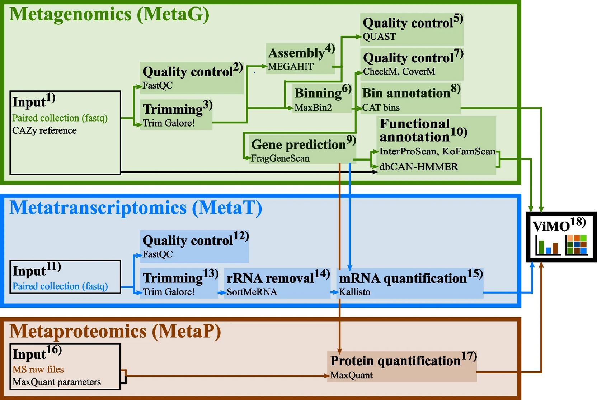
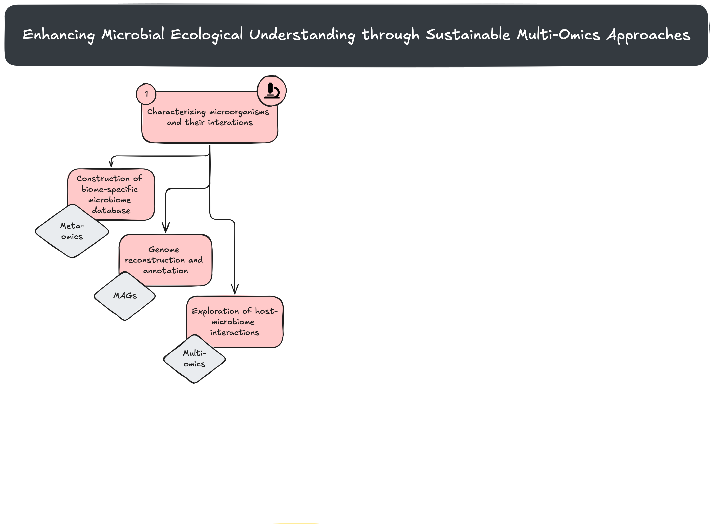
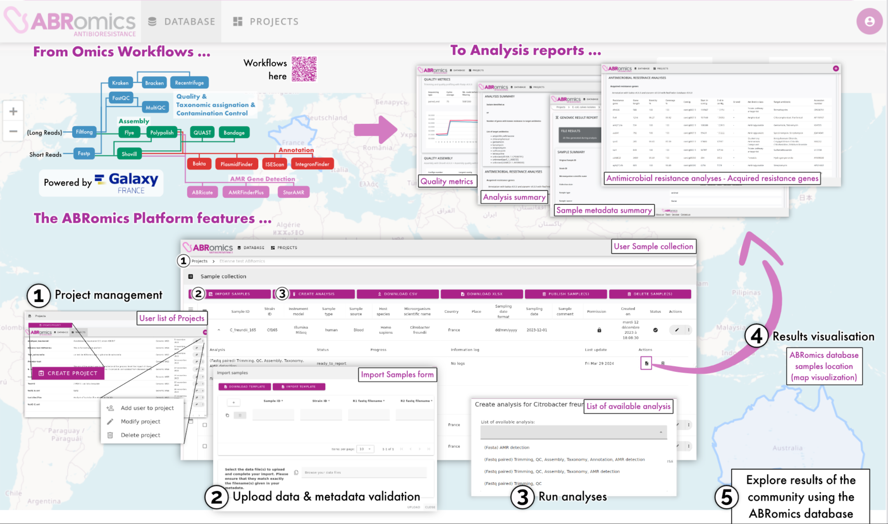
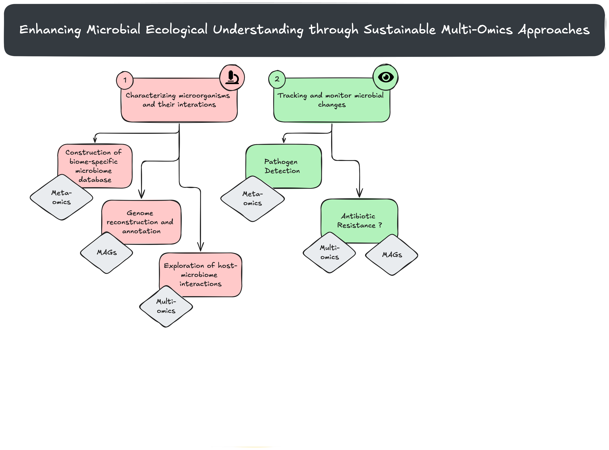
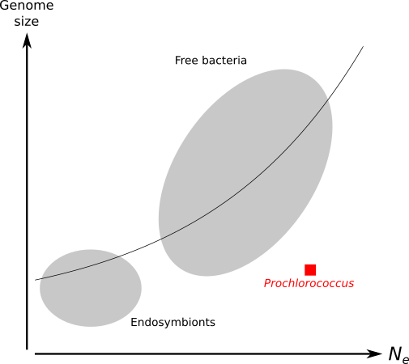
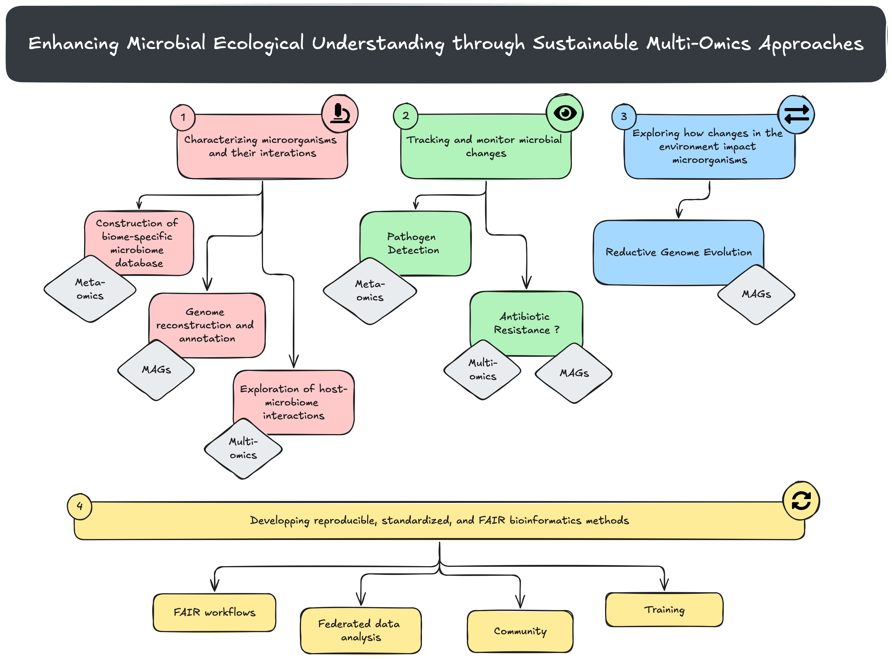

<!-- .slide: data-background="images/title.jpg" data-state="dim-background" -->
### Enhancing Microbial Ecological Understanding through Sustainable Multi-Omics Approaches

#### A Project Proposal and Collaboration Opportunities at LMGE

 

Bérénice Batut

<small>Institut Francais de Bioinformatique / Auvergne Bioinformatique, Université Clermont Auvergne   She/her - <i class="fab fa-github"></i> @bebatut - <i class="fas fa-envelope"></i> berenice.batut@uca.fr</small>

<small>Séminaire LMGE - October 2024</small>

<small style="position: absolute; right: 0%; font-size: 0.2em; ">Photo by [Elena Mozhvilo](https://unsplash.com/@miracleday?utm_source=unsplash&utm_medium=referral&utm_content=creditCopyText) on [Unsplash](https://unsplash.com/?utm_source=unsplash&utm_medium=referral&utm_content=creditCopyText) </small>

Note:

- Clarify that the talk will cover both your past work and your future vision for bioinformatics infrastructure.

---

<!-- .slide: data-background="images/education.jpg" data-state="dim-background" -->

## My background <!-- .element style="color: white; background: black; padding-bottom: 20px" -->

<small style="position: absolute; right: 0%; font-size: 0.2em; bottom: -20%;">Photo by <a href="https://unsplash.com/@aaronburden?utm_content=creditCopyText&utm_medium=referral&utm_source=unsplash">Aaron Burden</a> on <a href="https://unsplash.com/photos/opened-book-QJDzYT_K8Xg?utm_content=creditCopyText&utm_medium=referral&utm_source=unsplash">Unsplash</a></small>

Note:

- Briefly introduce yourself and your research journey.
- Highlight key experiences and motivations that led you to focus on microorganism-environment interactions.

----

### Education

 

 <!-- .element width="100%" -->

<i class="fas fa-calendar"></i> 2008-2011: Master of Engineering
 <i class="fas fa-dot-circle"></i> **Bioinformatics** & modelling
 <i class="fas fa-map-marker-alt"></i> INSA Lyon

<i class="fas fa-calendar"></i> 2010-2011: Master degree
 <i class="fas fa-dot-circle"></i> Complex system modelling
 <i class="fas fa-map-marker-alt"></i> ENS Lyon

Note:
- 2008-2011
    - Master of Engineering - Bioinformatics and modelling - INSA Lyon
    - Last year in parallel: Master degree - Theoretical computer science - Complex system modelling - ENS Lyon

----
### Education

 

 <!-- .element width="100%" -->

<i class="fas fa-calendar"></i> 2008-2011: Master of Engineering
 <i class="fas fa-dot-circle"></i> **Bioinformatics** & modelling
 <i class="fas fa-map-marker-alt"></i> INSA Lyon

<i class="fas fa-calendar"></i> 2010-2011: Master degree
 <i class="fas fa-dot-circle"></i> Complex system modelling
 <i class="fas fa-map-marker-alt"></i> ENS Lyon

<i class="fas fa-calendar"></i> 2011-2014: PhD
 <i class="fas fa-dot-circle"></i> **Bacterial** reductive genome **evolution**; *In silico* experimental evolution, **Comparative genomics / phylogeny**
 <i class="fas fa-map-marker-alt"></i> LBBE & LIRIS, INSA Lyon

Note:
- 2008-2011
    - Master of Engineering - Bioinformatics and modelling - INSA Lyon
    - Last year in parallel: Master degree - Theoretical computer science - Complex system modelling - ENS Lyon

----
### Postdocs: From bacterial isolate to microbiome

 <!-- .element width="100%" -->

<i class="fas fa-calendar"></i> 2015-2016: Postdoc 
 <i class="fas fa-dot-circle"></i> **Gut metagenomics**; **Tool/Workflow development**
 <i class="fas fa-map-marker-alt"></i> CIDAM, Université d'Auvergne - Clermont-Ferrand

Note:
- 2015-2016
    - Postdoc - Clermont-Ferrand

Aim of the project

- Collect gut microbiota datasets in different databases
- Analyze them given a standard workflow

----
### Postdocs: From bacterial isolate to microbiome

 <!-- .element width="100%" -->

<i class="fas fa-calendar"></i> 2015-2016: Postdoc 
 <i class="fas fa-dot-circle"></i> **Gut metagenomics**; **Tool/Workflow development**
 <i class="fas fa-map-marker-alt"></i> CIDAM, Université d'Auvergne - Clermont-Ferrand

<i class="fas fa-calendar"></i> 2016-2023: Postdoc 
 <i class="fas fa-dot-circle"></i> Microbiome; **Data analyses**, **Tool/Workflow development**, **Training**, **Community**
 <i class="fas fa-map-marker-alt"></i> [Freiburg Galaxy Team](https://galaxyproject.eu/freiburg/), Germany</small>

Note:
- 2016-now
    - Postdoc - Freiburg Galaxy team with Björn Grüning
    - de.NBI / ELIXIR
    - Gave up on idea to become Professor
    - Data analysis: RNA-seq, Microbiome - ASaiM
    - Tool development: Microbiome, Galaxy
    - Training, mentoring, community building
     
----
### Back in France

 

<i class="fas fa-calendar"></i> 2024-Now: Research engineer 
 <i class="fas fa-dot-circle"></i> Microbiome; **Data analyses**, **Tool/Workflow development**, **Training**
 <i class="fas fa-map-marker-alt"></i> [Institut Francais de Bioinformatique](https://www.france-bioinformatique.fr/), [Platforme Auvergne Bioinformatique](https://mesocentre.uca.fr/projets-associes/plateforme-aubi), Université Clermont Auvergne</small>

---

<!-- .slide: data-background="images/crossroad.jpg" data-state="dim-background" -->

## And Now? <!-- .element style="color: white; background: black; padding-bottom: 20px" -->

Note:

- **Key Lessons Learned**
  - Summarize the most significant challenges and lessons from your past work, particularly in terms of scalability, reproducibility, and cross-disciplinary collaboration.
- **Bridging to the Future**
  - Introduce your long-term goal: advancing bioinformatics infrastructure to enable deeper insights into microorganism-environment interactions.

----

### Our world belongs to the microorganisms

 

 <!-- .element width="80%" style="box-shadow: 5px 5px 5px grey !important;" -->

 <!-- .element width="80%" style="box-shadow: 5px 5px 5px grey !important;" -->

 <!-- .element width="80%" style="box-shadow: 5px 5px 5px grey !important; margin-left: 40px; margin-top: -100px;" -->

----

### My goal (now)

## Enhancing **Microbial Ecological** Understanding through **Sustainable Multi-Omics** Approaches

Note:

My big biological question

----

### 4 questions for enhancing microbial ecological understanding through sustainable multi-omics

1. <i class="fas fa-microscope"></i> How can we effectively **characterize microorganisms** and their **interactions** with their environment or host?
<!-- .element style="background: #ffcaca" -->

2. <i class="fas fa-eye"></i> How can we **track and monitor microbial changes**?
<!-- .element style="background: #b2f2bb" -->

3. <i class="fas fa-exchange-alt"></i> How do **changes** in the environment or host **impact microorganisms**?
<!-- .element style="background: #a5d8ff" -->

4. <i class="fas fa-sync-alt"></i> How can we develop reproducible, standardized, and FAIR bioinformatics methods to answer these questions while managing the complexity and scale of microbiome research?
<!-- .element style="background: #ffec99" -->

----
<small style="position: absolute; top: -3%; left: 0%; background: #ffcaca">1. <i class="fas fa-microscope"></i> Question</small>

<small style="position: absolute; top: -3%; right: 0%">Previous/Ongoing/Planned work</small>

### Legend for the following slides

- Some explanation of the work
- Or plans

---

### 4 questions for enhancing microbial ecological understanding through sustainable multi-omics

1. <i class="fas fa-microscope"></i> How can we effectively **characterize microorganisms** and their **interactions** with their environment or host?

<!-- .element style="background: #ffcaca" -->

----
<small style="position: absolute; top: -3%; left: 0%; background: #ffcaca">1. <i class="fas fa-microscope"></i> Characterizing microorganisms and their interations</small>

<small style="position: absolute; top: -3%; right: 0%">Previous work</small>

### Building standardized and tested workflows for metagenomics/metatranscriptomics

![ASaiM main workflow to analyze raw shotgun metagenomics data. It has 4 parts: PROCESSING (represented yellow boxes), TAXONOMIC ANALYSES (represented by the red boxes), FUNCTIONAL ANALYSES (represented by the purple boxes), FUNCTIONAL AND TAXONOMIC COMBINATION (represented by the green boxes). The workflow starts on the left, in PROCESSING part, from File "Raw reads" / FastQ on the left --> yellow box "Quality control (FastQC) and trimming (TrimGalore!)" --> File "Controlled reads" / Fasta --> yellow box "Dereplication (Vsearch)" --> File "Unique reads" / Fasta. The workflow branch then. (1) On the top, the TAXONOMIC ANALYSIS starts from the File "Unique reads" / Fasta --> red box "Taxonomic assignations (MetaPhlAn)" --> File "Taxa abundance" / Table --> 3 branches (from top to bottom): (1.1) red box "Visualization (GraPhlAn)" --> File "Community structure" / PNG; (1.2) red box "Visualization (KRONA)" --> File "Community structure" / HTML; (1.3) red box "Formatting for the different taxonomic levels" --> Different Files "Taxa abundance for species" / Table. 2 arrows start also from File "Taxa abundance" / Table to 2 boxes in FUNCTIONAL AND TAXONOMIC COMBINATION part. (2) On the bottom, the FUNCTIONAL ANALYSES starts from the File "Unique reads" / Fasta --> yellow box "rRNA/rDNA selection (SortMeRNA)" --> File "Non rRNA/rDNA reads" / Fasta --> purple box "Metabolic assignations (HUMAnN2)" --> 2 branches (from top to bottom): (2.1) File "Pathway abundance" / Table --> green box "Combination of taxonomic and metabolic assignations" --> File "Pathway abundance per taxa" / Table; (2.2) File "Gene family abundance" / Table --> 2 branches (from top to bottom): (2.2.1) green box "Combination of taxonomic and metabolic assignations" --> File "Gene family abundance per taxa" / Table; (2.2.2) purple box "Grouping to high level GO Slim terms" --> File "GOslim term abundance" / Table](images/asaim_main_wf.png) <!-- .element width="100%" -->

<small style="position: absolute; left: 0%;">[Batut et al, Gigascience, 2018](https://academic.oup.com/gigascience/article/7/6/giy057/5001424)</small>

Note:
- Introduce HUMAMnN, MetaPhlAn

----
<small style="position: absolute; top: -3%; left: 0%; background: #ffcaca">1. <i class="fas fa-microscope"></i> Characterizing microorganisms and their interations</small>

<small style="position: absolute; top: -3%; right: 0%">Previous work</small>

### Integrating meta-omics

 <!-- .element width="60%" -->

<small style="position: absolute; left: 0%;">[Schiml et al, Environmental Microbiome, 2023](https://environmentalmicrobiome.biomedcentral.com/articles/10.1186/s40793-023-00514-9)</small>

----
<small style="position: absolute; top: -3%; left: 0%; background: #ffcaca">1. <i class="fas fa-microscope"></i> Characterizing microorganisms and their interations</small>

<small style="position: absolute; top: -3%; right: 0%">Previous & Ongoing work</small>

### Building biome-specific microbiome database

By reanalyzing in a standardized way data from public database

 

 <!-- .element width="80%" style="box-shadow: 5px 5px 5px grey !important;" -->

Bee Microbiome DB

2 M1 Internships in 2024 together with **IHP Team**
- DB conception, including metadata evaluation
- Standardized workflow and explorative script conception

----

<small style="position: absolute; top: -3%; left: 0%; background: #ffcaca">1. <i class="fas fa-microscope"></i> Characterizing microorganisms and their interations</small>

<small style="position: absolute; top: -3%; right: 0%">Planned work</small>

### Contruction of biome-specific microbiome database

What I would like to do now?

- Populate the Bee Microbiome DB
- **Automatize** the process for reanalysis in Galaxy
- Include **interactive data explorations and comparative analysis**
- Curate **metadata** to improve comparative analyses
- Make the infrastructure usable for **any biome**
- Use **MGnify** workflows and publish results in MGnify database
- Include **other omics** data when available

**Possible collab.**: IHP Team?, Univ. of Freiburg 🇩🇪, EMBL-EBI 🇬🇧

----

 <!-- .element width="75%" -->

----

<small style="position: absolute; top: -3%; left: 0%; background: #ffcaca">1. <i class="fas fa-microscope"></i> Characterizing microorganisms and their interations</small>

<small style="position: absolute; top: -3%; right: 0%">Previous work</small>

### Studied impact of gut microbiome on mice microglia gene expression

 <!-- .element width="100%" -->

<small style="position: absolute; left: 0%;">[Mossad, Batut, et al, Nat Neurosc, 2022](https://www.nature.com/articles/s41593-022-01027-3)</small>

Note:

Orchestration by microbiota of microglial transcriptome in young and aged mice

----

<small style="position: absolute; top: -3%; left: 0%; background: #ffcaca">1. <i class="fas fa-microscope"></i> Characterizing microorganisms and their interations</small>

<small style="position: absolute; top: -3%; right: 0%">Previous work</small>

### Studied impact of gut microbiome on mice microglia gene expression

 <!-- .element width="60%" -->

<small style="position: absolute; left: 0%;">[Mossad, Batut, et al, Nat Neurosc, 2022](https://www.nature.com/articles/s41593-022-01027-3)</small>

Note:

Age-dependent shift in mouse gut microbiota composition

----
<small style="position: absolute; top: -3%; left: 0%; background: #ffcaca">1. <i class="fas fa-microscope"></i> Characterizing microorganisms and their interations</small>

<small style="position: absolute; top: -3%; right: 0%">Planned work</small>

### Exploration of host-microbiome interactions

What I would like to do?

- Identify (public) data combining different omics data for host (bees?) and their microbiome
- Develop **standardized holo-omics workflows for multi-omics integration**
- Develop benchmarking methods for multi-omics integration workflows

**Possible collab.**: IHP Team?

----

 <!-- .element width="75%" -->

----
<small style="position: absolute; top: -3%; left: 0%; background: #ffcaca">1. <i class="fas fa-microscope"></i> Characterizing microorganisms and their interations</small>

<small style="position: absolute; top: -3%; right: 0%">Ongoing   work</small>

### Reconstructing and annotating genome from metagenomics data

 <!-- .element width="75%" -->

FAIRyMAGs
- Workflow Finalization, Training Material Development, Real Data Evaluation, and Resource Allocation Tool Creation
- 100k€ funded by ELIXIR 
- **Collab.**: Univ. of Freiburg 🇩🇪, EMBL-EBI 🇬🇧, Univ. of Bari 🇮🇹

----
<small style="position: absolute; top: -3%; left: 0%; background: #ffcaca">1. <i class="fas fa-microscope"></i> Characterizing microorganisms and their interations</small>

<small style="position: absolute; top: -3%; right: 0%">Planned work</small>

### Genome reconstruction and annotation

What I would like to do after?

- Develop **benchmarking infrastructure** for MAGs building workflows (Critical Assessment Challenge?)
- Develop standardized workflows
  - **Not only for bacteria**
  - **Long-reads**
  - **Single-cell amplified genomes**

**Possible Collab**: Univ. of Freiburg 🇩🇪, John Hopkins 🇺🇸?

----

 <!-- .element width="75%" -->

---

### 4 questions for enhancing microbial ecological understanding through sustainable multi-omics

1. <i class="fas fa-microscope"></i> How can we effectively **characterize microorganisms** and their **interactions** with their environment or host?
<!-- .element style="background: #ffcaca" -->

2. <i class="fas fa-eye"></i> How can we **track and monitor microbial changes**?
<!-- .element style="background: #b2f2bb" -->

----

<small style="position: absolute; top: -3%; left: 0%; background: #b2f2bb">2. <i class="fas fa-eye"></i> Tracking and monitor microbial changes</small>

<small style="position: absolute; top: -3%; right: 0%">Previous & Ongoing work</small>

### (meta)genomics workflows for (foodborne) pathogens detection

 <!-- .element width="70%" -->

<small style="position: absolute; left: 0%;">[Nasr et al, BioRXiv, 2024](https://www.biorxiv.org/content/10.1101/2024.06.26.600753v1)</small>

----

<small style="position: absolute; top: -3%; left: 0%; background: #b2f2bb">2. <i class="fas fa-eye"></i> Tracking and monitor microbial changes</small>

<small style="position: absolute; top: -3%; right: 0%">Planned work</small>

### Pathogen detection

What I would like to do?

- Improve the sensitivity and specificity of the methods
- Test with different food vehicle, different pathogens, and pathogen combinations
- Adapt for **Wastewater**

**Possible Collab.**: University of Freiburg 🇩🇪, CERTH 🇬🇷, ELIXIR Wastewater Surveillance Working Group 

----

 <!-- .element width="75%" -->

----
<small style="position: absolute; top: -3%; left: 0%; background: #b2f2bb">2. <i class="fas fa-eye"></i> Tracking and monitor microbial changes</small>

<small style="position: absolute; top: -3%; right: 0%">Ongoing work</small>

### ABRomics

A Galaxy-based One Health Antimicrobial Resistance Platform

 <!-- .element width="70%" style="box-shadow: 5px 5px 5px grey !important;" -->

----
<small style="position: absolute; top: -3%; left: 0%; background: #b2f2bb">2. <i class="fas fa-eye"></i> Tracking and monitor microbial changes</small>

<small style="position: absolute; top: -3%; right: 0%">Ongoing work</small>

### ABRomics

A Galaxy-based One Health Antimicrobial Resistance Platform

 <!-- .element width="70%" -->

----
<small style="position: absolute; top: -3%; left: 0%; background: #b2f2bb">2. <i class="fas fa-eye"></i> Tracking and monitor microbial changes</small>

<small style="position: absolute; top: -3%; right: 0%">Planned work</small>

### Antibiotic Resistance

What I would like to do?

- MAGs?
- Multi-omics?

----

 <!-- .element width="75%" -->

---

### 4 questions for enhancing microbial ecological understanding through sustainable multi-omics

1. <i class="fas fa-microscope"></i> How can we effectively **characterize microorganisms** and their **interactions** with their environment or host?
<!-- .element style="background: #ffcaca" -->

2. <i class="fas fa-eye"></i> How can we **track and monitor microbial changes**?
<!-- .element style="background: #b2f2bb" -->

3. <i class="fas fa-exchange-alt"></i> How do **changes** in the environment or host **impact microorganisms**?
<!-- .element style="background: #a5d8ff" -->

----

<small style="position: absolute; top: -3%; left: 0%; background: #a5d8ff">3. <i class="fas fa-exchange-alt"></i> Exploring changes in environment on microorganisms</small>

<small style="position: absolute; top: -3%; right: 0%">Previous work</small>

### Smallest genomes in the smallest populations?

 <!-- .element width="40%" -->

<small>Figure inspired from [Kuo et al, 2009](http://genome.cshlp.org/content/19/8/1450.short)</small>

<small style="position: absolute; left: 0%;">[Batut et al, Nat Rev Microbiol, 2014](https://www.nature.com/articles/nrmicro3331)</small>

Note: 

Relation between effective population size and genome size

----

<small style="position: absolute; top: -3%; left: 0%; background: #a5d8ff">3. <i class="fas fa-exchange-alt"></i> Exploring changes in environment on microorganisms</small>

<small style="position: absolute; top: -3%; right: 0%">Previous work</small>

### *in silico* experimental evolution

 <!-- .element width="70%" -->

<small>Figure inspired from [Hindré et al, 2012](https://www.nature.com/articles/nrmicro2750)</small>

----

<small style="position: absolute; top: -3%; left: 0%; background: #a5d8ff">3. <i class="fas fa-exchange-alt"></i> Exploring changes in environment on microorganisms</small>

<small style="position: absolute; top: -3%; right: 0%">Previous work</small>

### Using *in silico* experimental evolution to test reductive genome evolution hypotheses

 <!-- .element width="50%" -->

<small style="position: absolute; left: 0%;">[Batut et al, BMC Bioinformatics, 2013](https://link.springer.com/article/10.1186/1471-2105-14-S15-S11)</small>

----

<small style="position: absolute; top: -3%; left: 0%; background: #a5d8ff">3. <i class="fas fa-exchange-alt"></i> Exploring changes in environment on microorganisms</small>

<small style="position: absolute; top: -3%; right: 0%">Planned work</small>

### Reductive Genome Evolution

What I would like to do?

- Build a database of genomes from public data and reconstructed MAGs of species that have undergone reductive genome evolution and their close relatives
- Test artificial evolution predictions for reductive genome evolution on data from this database

**Possible Collab.**: BEAGLE (INRIA, INSA Lyon)

----

 <!-- .element width="75%" -->

---

### 4 questions for enhancing microbial ecological understanding through sustainable multi-omics

1. <i class="fas fa-microscope"></i> How can we effectively **characterize microorganisms** and their **interactions** with their environment or host?
<!-- .element style="background: #ffcaca" -->

2. <i class="fas fa-eye"></i> How can we **track and monitor microbial changes**?
<!-- .element style="background: #b2f2bb" -->

3. <i class="fas fa-exchange-alt"></i> How do **changes** in the environment or host **impact microorganisms**?
<!-- .element style="background: #a5d8ff" -->

4. <i class="fas fa-sync-alt"></i> How can we develop reproducible, standardized, and FAIR bioinformatics methods to answer these questions while managing the complexity and scale of microbiome research?
<!-- .element style="background: #ffec99" -->

----

<small style="position: absolute; top: -3%; left: 0%; background: #ffec99">4. <i class="fas fa-sync-alt"></i> Developing reproducible, standardized, and FAIR bioinformatics methods</small>

<small style="position: absolute; top: -3%; right: 0%">Planned work</small>

### Developing reproducible, standardized, and FAIR bioinformatics methods

What I would like to do?
- Make all my **workflows FAIR**

Note:

- FAIR workflows
    - Reduce the entry barrier for meta-omics data analysis 
    - BRC Analytics?

----

<small style="position: absolute; top: -3%; left: 0%; background: #ffec99">4. <i class="fas fa-sync-alt"></i> Developing reproducible, standardized, and FAIR bioinformatics methods</small>

<small style="position: absolute; top: -3%; right: 0%">Planned work</small>

### Developing reproducible, standardized, and FAIR bioinformatics methods

What I would like to do?
- Make all my **workflows FAIR**
- Document and build capacity around them using **Training**

Note:

- Training
    - GTN beyond Galaxy 

----
<small style="position: absolute; top: -3%; left: 0%; background: #ffec99">4. <i class="fas fa-sync-alt"></i> Developing reproducible, standardized, and FAIR bioinformatics methods</small>

<small style="position: absolute; top: -3%; right: 0%">Planned & Ongoing work</small>

### Galaxy Training Network

 <!-- .element style="box-shadow: 5px 5px 5px grey !important;" -->

An **online & open infrastructure** to empower scientists and instructors
- 400+ tutorials in 30+ topics
- 190+ (130+ hours) videos 
- Computational resources: Data / Tools / Servers / TIaaS
- 400+ contributors
- Massive Online Events with 2k+ participants

<small style="position: absolute; left: 0%;">[Batut et al, Cell, 2018](https://www.cell.com/cell-systems/fulltext/S2405-4712(18)30230-8), [Hilterman et al, PLOS Comp Biol, 2023](https://journals.plos.org/ploscompbiol/article?id=10.1371/journal.pcbi.1010752)</small>

Note:
- Start to build an online training infrastructure for the Galaxy community
    - Rewamp GTN
    - Strengthen the community with events
- Teaching to empower 
    - users in their analysis
    - new contributors
- Big efforts to learn from different experiences
- ~40K visitors per months

----

<small style="position: absolute; top: -3%; left: 0%; background: #ffec99">4. <i class="fas fa-sync-alt"></i> Developing reproducible, standardized, and FAIR bioinformatics methods</small>

<small style="position: absolute; top: -3%; right: 0%">Planned work</small>

### Developing reproducible, standardized, and FAIR bioinformatics methods

What I would like to do?
- Make all my **workflows FAIR**
- Document and build capacity around them using **Training**
- Develop **Federated Data Analysis** especially between Galaxy and MGnify

Note:

- Federated Data Analysis
    - Allow LMIC to use similar resources 

----

<small style="position: absolute; top: -3%; left: 0%; background: #ffec99">4. <i class="fas fa-sync-alt"></i> Developing reproducible, standardized, and FAIR bioinformatics methods</small>

<small style="position: absolute; top: -3%; right: 0%">Planned work</small>

### Developing reproducible, standardized, and FAIR bioinformatics methods

What I would like to do?
- Make all my **workflows FAIR**
- Document and build capacity around them using **Training**
- Develop **Federated Data Analysis** especially between Galaxy and MGnify
- Engage, Develop and Manage strong and supportive **communities** to support all this work 

Note:

- Community

----

<small style="position: absolute; top: -3%; left: 0%; background: #ffec99">4. <i class="fas fa-sync-alt"></i> Developing reproducible, standardized, and FAIR bioinformatics methods</small>

<small style="position: absolute; top: -3%; right: 0%">Ongoing work</small>

### microGalaxy

 

 <!-- .element width="80%" style="box-shadow: 5px 5px 5px grey !important;" -->

A gateway to tools, workflows, and training for accessible, reproducible and FAIR of **microbial** data analysis

- 290+ Tool suites
- 20+ ready-to-use **Workflows**
- 20+ **Tutorials**, 3 learning pathways
- A dedicated **interface**
- A vibrant **community** with 50+ members, Quaterly meetings, Chat, Working groups

<small style="position: absolute; left: 0%;">Nasr et al, Writing</small>

----

 <!-- .element width="75%" -->

---

<!-- .slide: data-background="images/collaboration.jpg" data-state="dim-background" -->

## Would you be interested in collaborating? <!-- .element style="color: white; background: black; padding-bottom: 20px" -->

---

 <!-- .element width="75%" -->

Note: 

### **Conclusion and Takeaways** (5 minutes)
   - Summarize the key aspects of your past work and how they inform your future research.
   - Reiterate the importance of building sustainable, FAIR, and reproducible bioinformatics platforms for microbiome studies.
   - Encourage questions and further discussions on potential collaborations.

---

<!-- .slide: data-background="images/thank_you.jpg" -->

<small style="position: absolute; right: 0%; font-size: 0.2em; bottom: -20%;">
Photo by <a href="https://unsplash.com/@alexas_fotos?utm_content=creditCopyText&utm_medium=referral&utm_source=unsplash">Alexas_Fotos</a> on <a href="https://unsplash.com/photos/brown-and-white-wooden-arrow-sign-pnGjbJEmU3o?utm_content=creditCopyText&utm_medium=referral&utm_source=unsplash">Unsplash</a></small>
  

---

 <!-- .element width="75%" -->
